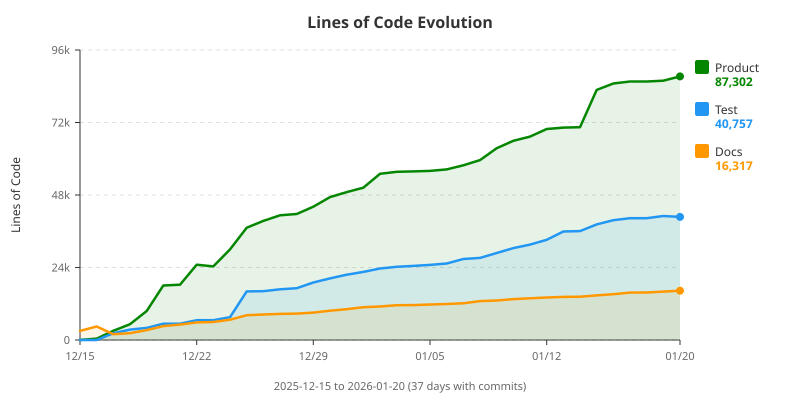
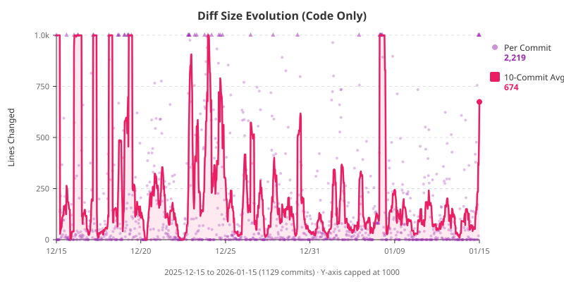

# Cells

A modern spreadsheet engine with real-time collaboration, Excel compatibility, and powerful CLI tools.

**[Try the Live Demo](https://cells.example.com)** | [Documentation](./docs/)

## What is Cells?

Cells is a spreadsheet engine that runs entirely in your browser. It combines the familiarity of Excel with modern features:

- **Real-time collaboration** - Edit together with P2P sync (no server required for document data)
- **Excel compatible** - Import and export .xlsx files seamlessly
- **CLI tools** - Convert, inspect, and sync spreadsheets from the command line
- **Git-friendly** - Text-based file format that diffs cleanly

## Quick Start

### Web UI

```bash
# Build and serve locally
bazel run :wasm-dist
bazel run :serve
# Open http://localhost:8081
```

### CLI Tool

```bash
# Build the CLI
bazel run :cli

# Convert Excel to Cells format
./dist/cli/cells convert spreadsheet.xlsx output.zcd

# Inspect a file
./dist/cli/cells info spreadsheet.zcd
```

## Features

### Spreadsheet Engine
- Formula engine with 80+ Excel-compatible functions
- Dependency graph for reactive updates
- Multi-sheet support
- Number formatting with Excel format codes

### Collaboration
- Peer-to-peer sync via WebRTC
- CRDT-based conflict resolution (concurrent edits just work)
- Real-time cursor and selection sharing
- No relay servers - document data stays between peers

### Web UI
- Canvas-based rendering with virtual scrolling
- Inline cell editing and formula bar
- Column/row resizing and drag-to-reorder
- Keyboard navigation (arrow keys, Tab, Enter)
- Drag-and-drop XLSX import

### CLI Tools
- Format conversion: `xlsx <-> zcd`
- File inspection and validation
- Headless spreadsheet operations

## Architecture

```
┌─────────────────────────────────────────────────────┐
│              Web UI (TypeScript)                    │
│         Canvas rendering, event handling           │
└─────────────────────────────────────────────────────┘
                        │ WASM
                        ▼
┌─────────────────────────────────────────────────────┐
│             Core Engine (C++17)                     │
│    Data Model  │  Formulas  │  CRDT Operations     │
└─────────────────────────────────────────────────────┘
                        │
                        ▼
┌─────────────────────────────────────────────────────┐
│              Persistence Layer                      │
│   Native: .zcd  │  Import/Export: .xlsx, .csv      │
└─────────────────────────────────────────────────────┘
```

The engine compiles to WebAssembly for the browser and native code for the CLI. All mutations go through CRDT operations, making collaboration a first-class feature rather than an afterthought.

### ZCD File Format

Cells uses its own text-based format (`.zcd`) designed for Git-friendly persistence and CRDT collaboration. Key features:

- **One entity per line** - Editing a cell changes exactly one line, making diffs minimal
- **8-character base62 IDs** - Compact UUIDs (218 trillion combinations) for cells, columns, rows
- **Content-addressed styles** - Styles and formats stored as base64 hashes, deduplicated automatically
- **CRDT operation log** - Full history for sync and conflict resolution

Example (a simple 2×2 sheet with A1=42, B1="hello"):

```
#zcd v1
D Qx7mXp2L "Budget"

S bF3hL8mN "Sheet1"
C kR7pN2wQ 0
C vT5mK9xL 1
R jH4sW8nF 0
X nP6kR2mW kR7pN2wQ jH4sW8nF n 42
X hT8sL4xQ vT5mK9xL jH4sW8nF s "hello"
```

See [docs/persistence.md](./docs/persistence.md) for the full specification.

For detailed architecture documentation, see [docs/](./docs/).

## Requirements

- **Bazel** 7.0+
- **C++17** compiler (Clang, GCC, or MSVC)
- **Go 1.22+** (for development server; macOS 15+ requires 1.22)

## Build Commands

```bash
# Build
bazel run :cli              # CLI tool → dist/cli/cells
bazel run :wasm-dist        # Web app → dist/wasm/

# Test
bazel run :test             # Unit tests
bazel run :e2e              # E2E tests (headless)
bazel run :e2e-headed       # E2E tests (visible browser)

# Code quality
bazel run :lint             # Run linter
bazel run :format           # Format code
bazel run :check            # All checks (test + lint + types)
```

## Documentation

| Document | Description |
|----------|-------------|
| [Data Model](./docs/data-model.md) | Cell addressing, spatial indexing |
| [CRDT](./docs/crdt.md) | Collaboration operations and sync |
| [Formula Engine](./docs/formula-engine.md) | Parser, evaluation, dependencies |
| [Persistence](./docs/persistence.md) | File formats (.zcd, .xlsx) |
| [Networking](./docs/networking.md) | P2P connections, signaling |
| [Rendering](./docs/rendering.md) | Canvas rendering pipeline |
| [Type System](./docs/type-system.md) | Optional column typing |

## Project Stats

| Category | Count |
|----------|------:|
| C++ (core) | 45,004 lines |
| TypeScript (UI) | 23,659 lines |
| Unit tests | 3,481 |
| E2E tests | 384 |
| Total tests | 3,908 |
| Commits | 1,521 |

<details>
<summary>Detailed stats</summary>

### Source Code

| Language | Lines |
|----------|------:|
| C++ | 45,004 |
| TypeScript | 23,659 |
| CSS | 2,706 |
| Starlark | 1,947 |
| JavaScript | 1,680 |
| Go | 1,363 |
| Shell | 1,168 |
| HTML | 1,051 |
| Objective-C++ | 1,007 |

### Test Code

| Language | Lines |
|----------|------:|
| C++ | 42,844 |
| JavaScript | 13,606 |
| Go | 315 |

### Bundle Size

- WASM Module: 5.14 MB
- Total Web Bundle: 7.23 MB

<sub>Lines counted with [CLOC](https://github.com/AlDanial/cloc). Generate with `./tools/generate-stats.sh`</sub>

### LOC Evolution



### Diff Size Evolution



</details>

## License

[License information here]
