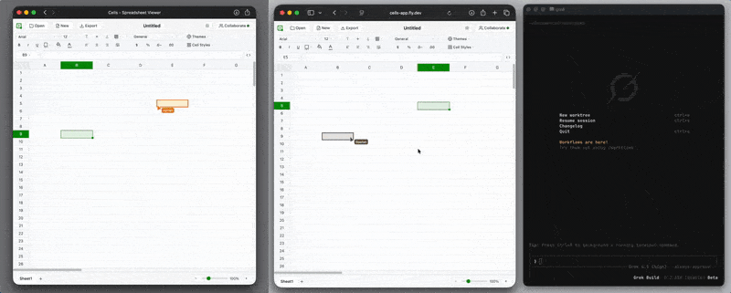
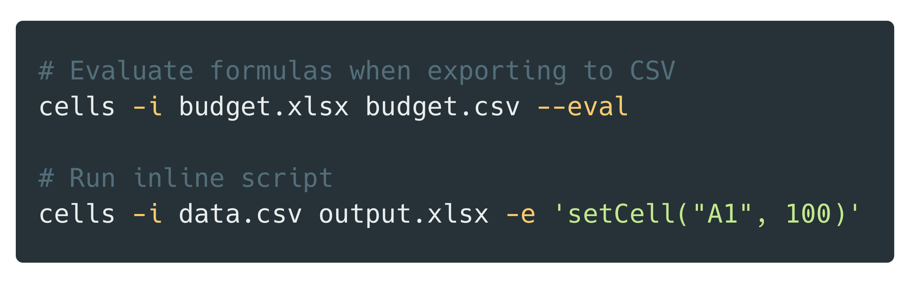
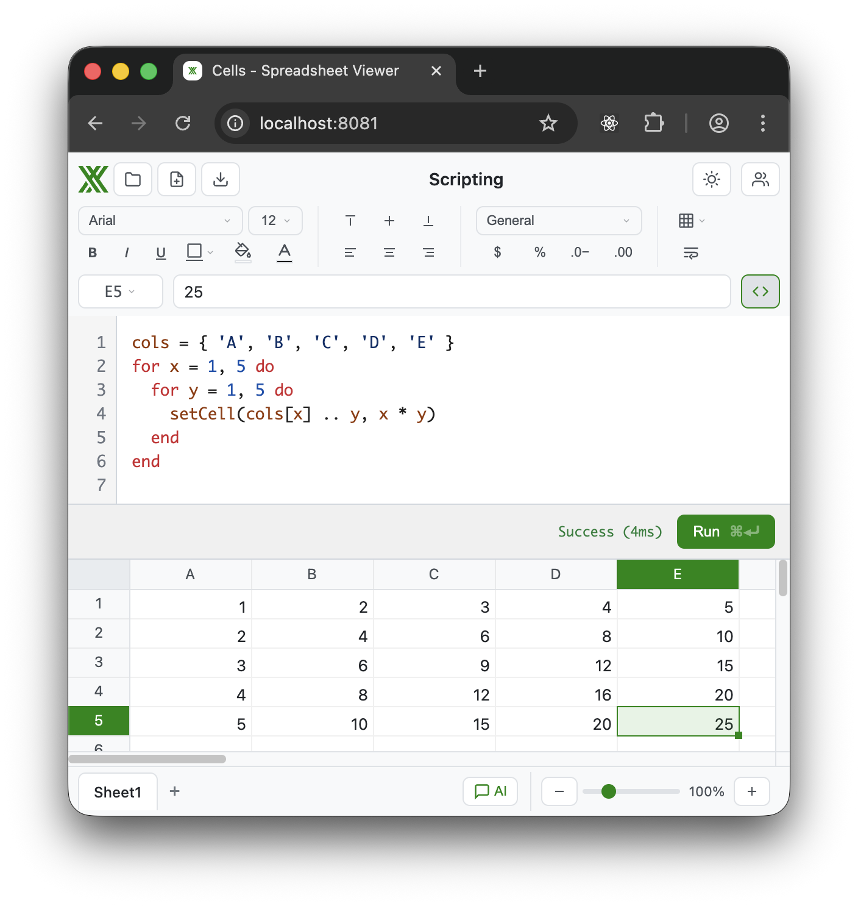

# Cells

A modern spreadsheet engine! 

Use it as a **browser-based alternative to Excel/Google Sheets**, or as a **lightweight headless CLI** for automation and scripting.

**[Demo](https://cells-app.fly.dev/)** | [GitHub Pages](https://aduermael.github.io/cells/) | [Documentation](./docs/)

## What is Cells?

Cells is a spreadsheet engine that works two ways:

1. **Web App:** A full spreadsheet UI in your browser. Real-time collaboration, Excel import/export.

   

2. **Headless CLI:** Run spreadsheet operations from the command line. Convert formats, batch process files, integrate into pipelines.

	

Both share the same core engine, so formulas and files work identically across environments.

**Key features:**

- **Lightweight & Fast**
- **Real-time collaboration** - Edit together with P2P sync
- **Excel compatible** - Import and export .xlsx files seamlessly
- **Fully scriptable** - Automate with [Luau](https://luau.org) scripts (Python, VBA, and TypeScript support planned)
- **Git-friendly** - [Text-based file format](#collaboration--zcd-format-) that diffs cleanly

## Install

Install methods for the **CLI**, in order of preference:

### 1. Agent skill (recommended)

Best default for agentic workflows. Installs a skill that knows how to install
and use the `cells` binary:

```bash
curl -fsSL https://raw.githubusercontent.com/aduermael/cells/main/install-skill.sh | sh
```

The skill lands in `.agents/skills/cells`, `.claude/skills/cells`, and
`.grok/skills/cells`. When `cells` is missing from `PATH`, agents run the
bundled `install.sh` (Homebrew first, then direct release install — no npm).

### 2. Homebrew

```bash
brew install aduermael/tap/cells
```

Requires the [Homebrew tap](https://github.com/aduermael/homebrew-tap) to be
published for a release. Formula assets are generated automatically on each
`v*` tag when tap credentials are configured.

### 3. Direct install (`curl | sh`)

Downloads the platform binary from the latest GitHub Release:

```bash
curl -fsSL https://raw.githubusercontent.com/aduermael/cells/main/install.sh | sh
```

User-local install (no sudo):

```bash
curl -fsSL https://raw.githubusercontent.com/aduermael/cells/main/install.sh \
  | env CELLS_INSTALL_DIR=$HOME/.local/bin sh
```

Pin a version: `CELLS_VERSION=v0.0.1`.

### 4. Build from source

```bash
bazel run :cli          # → dist/cli/cells
bazel run :cli-release  # optimized
```

### Optional: run the collaboration server

Not required for CLI conversion/scripting. Use this only if you want to host
the web UI + signaling yourself.

| Method | Command |
|--------|---------|
| **Public demo** | [https://cells-app.fly.dev/](https://cells-app.fly.dev/) |
| **Docker** | `docker build -t cells-server . && docker run -p 8080:8080 cells-server` |
| **Local dev** | `bazel run :wasm-dist && bazel run :serve` → http://localhost:8081 |

Point the CLI at any server URL for collab:

```bash
cells sync --server 'https://cells-app.fly.dev/?room=YOUR_ROOM'
# or
cells sync 'https://your-host/?room=YOUR_ROOM'
```

Tag a release (`git tag v0.0.1 && git push origin v0.0.1`) to build multi-platform
CLI assets and publish a GitHub Release automatically.

## Quick Start

### Web UI

```bash
# Build and serve locally
bazel run :wasm-dist
bazel run :serve
# Open http://localhost:8081
```

### CLI Tool

```bash
# After install, or: bazel run :cli → ./dist/cli/cells
cells -i spreadsheet.xlsx output.zcd
cells -I spreadsheet.zcd
```

#### Format Conversion

```bash
# Excel to native format
cells -i data.xlsx output.zcd

# CSV to Excel
cells -i report.csv report.xlsx

# Excel to CSV
cells -i budget.xlsx budget.csv
```

#### Formula Evaluation

Use `--eval` to recalculate formulas using the Cells calculation engine before export:

```bash
# Evaluate formulas when exporting to CSV
cells -i budget.xlsx budget.csv --eval

# Useful when XLSX cached values are stale or missing
cells -i calculations.xlsx results.csv --eval
```

#### Scripting



Run [Luau](https://luau.org) scripts to transform data, automate workflows, or analyze spreadsheets:

```bash
# Run a script file
cells -i data.xlsx output.csv --script transform.luau

# Run inline script
cells -i data.csv output.xlsx -e 'setCell("A1", 100)'

# Script-only mode (no output file)
cells -i report.xlsx --script analyze.luau
cells -i data.csv -e 'print(getCell("A1"))'
```

#### Empty Workbook Creation

Create new workbooks from scratch, optionally with scripted content:

```bash
# Create empty workbook
cells output.zcd
cells output.xlsx

# Create with initial content via script
cells output.xlsx -e 'setCell("A1", "Hello") setCell("A2", "=A1 & \" World\")'
```

## Architecture 🏛️

```
┌─────────────────────────────────────────────────────┐
│              Web UI (TypeScript)                    │
│         Canvas rendering, event handling            │
└─────────────────────────────────────────────────────┘
                        │ WASM
                        ▼
┌─────────────────────────────────────────────────────┐
│             Core Engine (C++17)                     │
│    Data Model  │  Formulas  │  CRDT Operations      │
└─────────────────────────────────────────────────────┘
                        │
                        ▼
┌─────────────────────────────────────────────────────┐
│              Persistence Layer                      │
│   Native: .zcd  │  Import/Export: .xlsx, .csv       │
└─────────────────────────────────────────────────────┘
```

The engine compiles to WebAssembly for the browser and native code for the CLI. All mutations go through CRDT operations, making collaboration a first-class feature rather than an afterthought.

### Collaboration & ZCD Format 📄

Cells uses peer-to-peer sync via WebRTC. Document data travels directly between clients with no relay servers. Concurrent edits merge automatically using CRDTs.

The native `.zcd` format (Zero Conflict Document) is designed for this:

- **One entity per line** - Editing a cell changes exactly one line, minimal diffs
- **Content-addressed styles** - Styles/formats stored as base64 hashes, auto-deduplicated
- **CRDT operation log** - Full edit history for sync and conflict resolution

```
D yRUosCbW "Untitled"
S FD3KLIgo "Sheet1"
C C4Jr2s32 1
C pYYl3eZ1 2
R Zv6vRn4q 1
X XO5lD1Nh C4Jr2s32 Zv6vRn4q n 42 fmt:DwICAQEk
X 1MvyBXyr pYYl3eZ1 Zv6vRn4q f "=~~XO5lD1Nh*10" fmt:DwICAQEk sty:BAAB
```
<sub>

```
#oplog
O 1769998913268.0.atyBEwwf CELL_SET XO5lD1Nh {"t":"n","v":"42","col":"C4Jr2s32","row":"Zv6vRn4q"}
O 1769998921630.0.atyBEwwf CELL_SET 1MvyBXyr {"t":"f","v":"=~~XO5lD1Nh*10","col":"pYYl3eZ1","row":"Zv6vRn4q"}
```

</sub>

See [docs/persistence.md](./docs/persistence.md) for the full specification.

For detailed architecture documentation, see [docs/](./docs/).

## AI Agents 🤖

A basic agent integration is available—provide an Anthropic API key and the agent can generate and execute Luau code to manipulate the spreadsheet.

> ⚠️ The current implementation is a prototype. The planned architecture will have agents run in their own app instances, communicating via CRDT operations—just like human collaborators. This ensures consistent conflict-free collaboration whether edits come from humans or AI.

## Requirements 📋

- **Bazel** 7.0+
- **C++17** compiler (Clang, GCC, or MSVC)
- **Go 1.22+** (for development server; macOS 15+ requires 1.22)

## Build Commands ⚙️

```bash
# Build
bazel run :cli              # CLI tool → dist/cli/cells
bazel run :wasm-dist        # Web app → dist/wasm/

# Build Linux CLI binaries (requires Docker)
./tools/cli-alpine.sh       # Alpine/musl (converter only) → dist/cli/cells-alpine
./scripts/linux-build.sh    # Debian/glibc (full CLI with sync) → dist/cli/cells-linux

# Test
bazel run :test             # Unit tests
bazel run :e2e              # E2E tests (headless)
bazel run :e2e-headed       # E2E tests (visible browser)

# Code quality
bazel run :lint             # Run linter
bazel run :format           # Format code
bazel run :check            # All checks (test + lint + types)

# Landing site (GitHub Pages artifact)
./tools/prepare-pages.sh    # → dist/pages/
```

## Deploy 🚀

Production deploys are **manual** GitHub Actions workflows (no auto-deploy on push):

| Workflow | What it deploys |
|----------|-----------------|
| **Deploy server (Fly.io)** | Collaboration server + WASM app → [cells-app.fly.dev](https://cells-app.fly.dev/) |
| **Deploy website (GitHub Pages)** | Minimal landing page (iframe demo + links) → GitHub Pages |
| **Deploy all** | Both of the above (reuses the same workflows) |

### GitHub `production` environment secrets

| Secret | Where | Required | Purpose |
|--------|-------|----------|---------|
| `FLY_API_TOKEN` | GitHub Environment **production** | Yes (server) | `flyctl deploy` |

### Fly app secrets (not GitHub)

Set with `fly secrets set` on the `cells-app` app:

| Secret | Required | Purpose |
|--------|----------|---------|
| `ANTHROPIC_API_KEY` | No | Enables the AI agent (`-enable-agent`) |

### One-time GitHub Pages setting

**Settings → Pages → Build and deployment → Source: GitHub Actions**

Local preview of the landing page:

```bash
./tools/prepare-pages.sh
# open dist/pages/index.html (iframe still loads the live Fly app)
```

## Documentation 📚

| Document | Description |
|----------|-------------|
| [Data Model](./docs/data-model.md) | Cell addressing, spatial indexing |
| [CRDT](./docs/crdt.md) | Collaboration operations and sync |
| [Formula Engine](./docs/formula-engine.md) | Parser, evaluation, dependencies |
| [Excel Parity](./docs/excel-parity.md) | Formulas, features, and XLSX fidelity tracker |
| [Persistence](./docs/persistence.md) | File formats (.zcd, .xlsx) |
| [Networking](./docs/networking.md) | P2P connections, signaling |
| [Rendering](./docs/rendering.md) | Canvas rendering pipeline |
| [Type System](./docs/type-system.md) | Optional column typing |
| [Project Stats](./docs/project-stats.md) | LOC, tests, build sizes, evolution graphs |

## License

Cells is dual-licensed:

1. **Open source (GPL-3.0)** — Free to use, modify, and distribute in open-source projects. If you distribute Cells (or a work based on it), you must also release the corresponding source under the GPL-3.0. See [LICENSE-GPL-3.0](./LICENSE-GPL-3.0).
2. **Commercial** — For proprietary or closed-source use, a commercial license is available. Reach out to discuss terms. See [LICENSE-COMMERCIAL](./LICENSE-COMMERCIAL).

Full dual-license notice: [LICENSE](./LICENSE).
